# Backstage System Architecture Documentation

> This document provides a detailed description of the Backstage Developer Portal system architecture

## Table of Contents

1. [System Overview](#1-system-overview)
2. [Overall Architecture](#2-overall-architecture)
3. [Frontend Architecture](#3-frontend-architecture)
4. [Backend Architecture](#4-backend-architecture)
5. [Plugin System](#5-plugin-system)
6. [Data Flow Architecture](#6-data-flow-architecture)
7. [Database Design](#7-database-design)
8. [Authentication & Permissions](#8-authentication--permissions)
9. [Deployment Architecture](#9-deployment-architecture)
10. [Technology Stack Details](#10-technology-stack-details)

---

## 1. System Overview

### 1.1 Project Information

| Item                 | Value                      |
| -------------------- | -------------------------- |
| Project Name         | Backstage Demo             |
| Version              | 1.47.0                     |
| Architecture Pattern | Monorepo (Yarn Workspaces) |
| Package Manager      | Yarn 4.4.1                 |
| Node.js Version      | 22 or 24                   |

### 1.2 Core Components

```
┌─────────────────────────────────────────────────────────────────┐
│                  Backstage Developer Portal                     │
├─────────────────────────────────────────────────────────────────┤
│  ┌─────────────┐  ┌─────────────┐  ┌─────────────┐              │
│  │  Frontend   │  │  Backend    │  │  Database   │              │
│  │  (React)    │  │  (Node.js)  │  │ (PostgreSQL)│              │
│  └─────────────┘  └─────────────┘  └─────────────┘              │
│                                                                  │
│  ┌─────────────────────────────────────────────────────────┐    │
│  │                    Plugin System                         │    │
│  │  Catalog | TechDocs | Scaffolder | Search | Kubernetes  │    │
│  └─────────────────────────────────────────────────────────┘    │
└─────────────────────────────────────────────────────────────────┘
```

---

## 2. Overall Architecture

### 2.1 System Layer Architecture

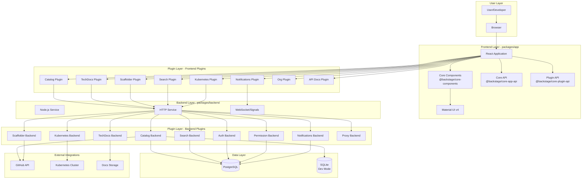

---

## 3. Frontend Architecture

### 3.1 Frontend Module Architecture

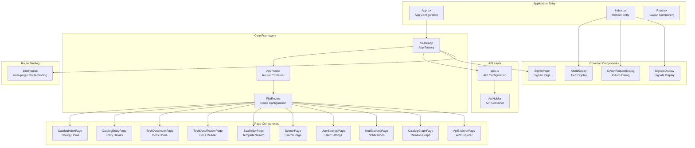

### 3.2 Frontend Route Structure

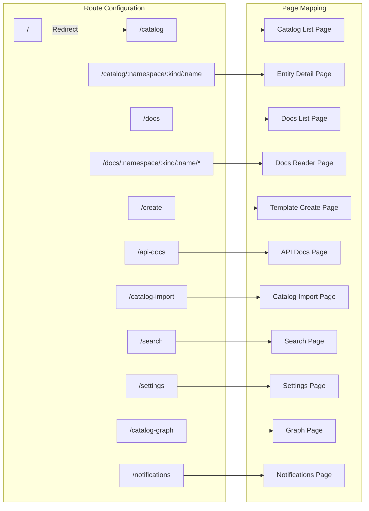

### 3.3 Frontend Plugin Dependencies

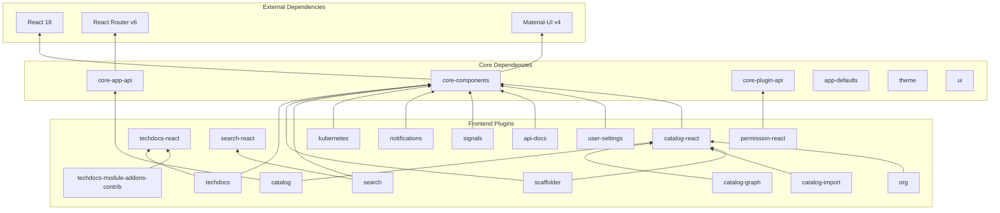

---

## 4. Backend Architecture

### 4.1 Backend Service Architecture

```mermaid
graph TB
    subgraph "Backend Entry"
        INDEX_TS[index.ts]
        CREATE_BACKEND[createBackend]
        BACKEND[Backend Instance]
    end

    subgraph "Core Plugins"
        APP_BE[App Backend<br/>Frontend Hosting]
        PROXY_BE[Proxy Backend<br/>API Proxy]
    end

    subgraph "Authentication Module"
        AUTH_BE[Auth Backend]
        GUEST_PROVIDER[Guest Provider<br/>Guest Auth]
        GITHUB_PROVIDER[GitHub Provider<br/>GitHub Auth]
    end

    subgraph "Catalog Module"
        CATALOG_BE[Catalog Backend]
        SCAFFOLDER_MODEL[Scaffolder Entity Model]
        CATALOG_LOGS[Catalog Logs Module]
    end

    subgraph "Documentation Module"
        TECHDOCS_BE[TechDocs Backend]
        DOCS_BUILDER[Local Builder]
        DOCS_GENERATOR[Docker Generator]
        DOCS_PUBLISHER[Local Publisher]
    end

    subgraph "Scaffolder Module"
        SCAFFOLDER_BE[Scaffolder Backend]
        GITHUB_MODULE[GitHub Module]
        NOTIF_MODULE[Notifications Module]
    end

    subgraph "Search Module"
        SEARCH_BE[Search Backend]
        PG_ENGINE[PostgreSQL Engine]
        CATALOG_COLLATOR[Catalog Collator]
        TECHDOCS_COLLATOR[TechDocs Collator]
    end

    subgraph "Permission Module"
        PERM_BE[Permission Backend]
        ALLOW_ALL[Allow All Policy]
    end

    subgraph "Kubernetes Module"
        K8S_BE[Kubernetes Backend]
    end

    subgraph "Notification Module"
        NOTIF_BE[Notifications Backend]
        SIGNALS_BE[Signals Backend]
    end

    INDEX_TS --> CREATE_BACKEND
    CREATE_BACKEND --> BACKEND

    BACKEND --> APP_BE
    BACKEND --> PROXY_BE
    BACKEND --> AUTH_BE
    AUTH_BE --> GUEST_PROVIDER
    AUTH_BE --> GITHUB_PROVIDER

    BACKEND --> CATALOG_BE
    CATALOG_BE --> SCAFFOLDER_MODEL
    CATALOG_BE --> CATALOG_LOGS

    BACKEND --> TECHDOCS_BE
    TECHDOCS_BE --> DOCS_BUILDER
    DOCS_BUILDER --> DOCS_GENERATOR
    DOCS_BUILDER --> DOCS_PUBLISHER

    BACKEND --> SCAFFOLDER_BE
    SCAFFOLDER_BE --> GITHUB_MODULE
    SCAFFOLDER_BE --> NOTIF_MODULE

    BACKEND --> SEARCH_BE
    SEARCH_BE --> PG_ENGINE
    SEARCH_BE --> CATALOG_COLLATOR
    SEARCH_BE --> TECHDOCS_COLLATOR

    BACKEND --> PERM_BE
    PERM_BE --> ALLOW_ALL

    BACKEND --> K8S_BE

    BACKEND --> NOTIF_BE
    BACKEND --> SIGNALS_BE
```

### 4.2 Backend Plugin Loading Sequence

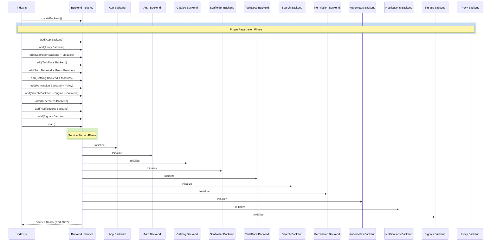

---

## 5. Plugin System

### 5.1 Plugin Classification Overview

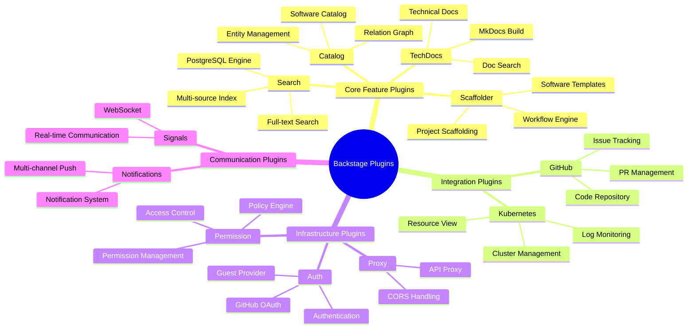

### 5.2 Frontend-Backend Plugin Mapping

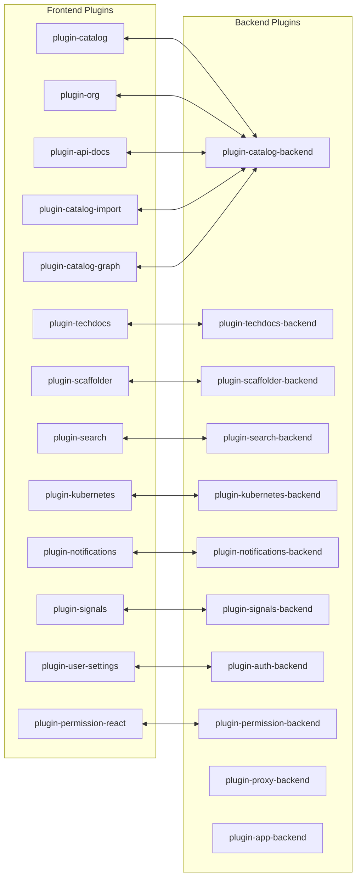

### 5.3 Inter-Plugin Route Binding

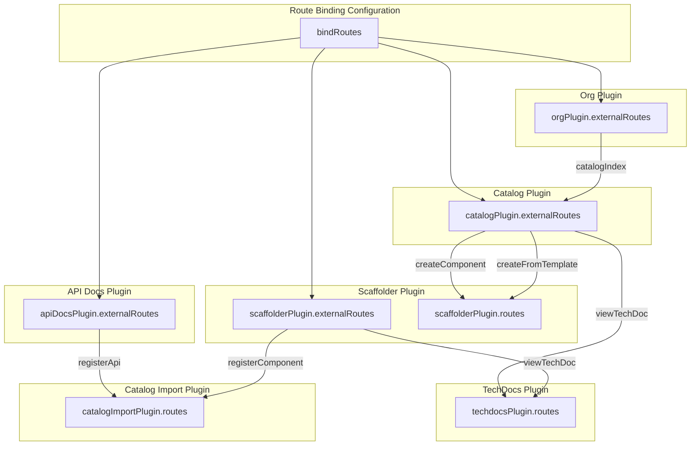

---

## 6. Data Flow Architecture

### 6.1 Request Processing Flow

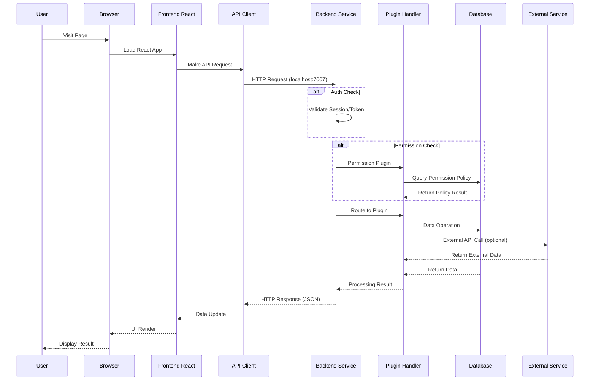

### 6.2 Catalog Data Flow

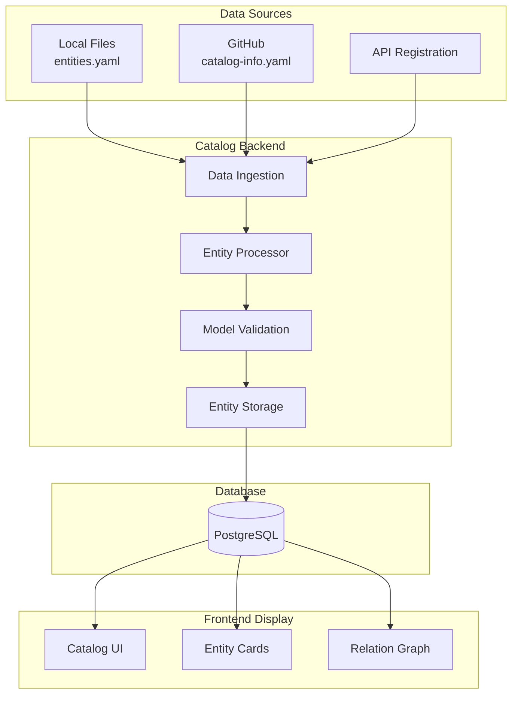

### 6.3 Scaffolder Workflow

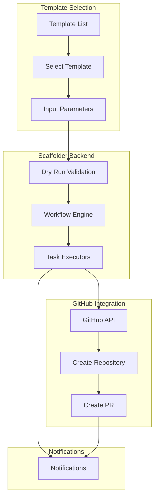

### 6.4 TechDocs Generation Flow

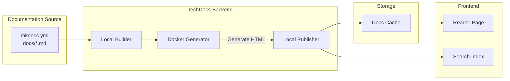

---

## 7. Database Design

### 7.1 Database Architecture

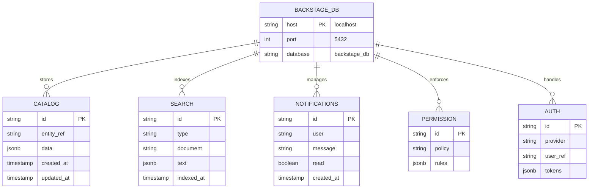

### 7.2 Database Configuration

| Environment | Client          | Connection     | Schema Mode                |
| ----------- | --------------- | -------------- | -------------------------- |
| Development | better-sqlite3  | :memory:       | Single File                |
| Production  | pg (PostgreSQL) | localhost:5432 | pluginDivisionMode: schema |

```yaml
# Database Configuration (app-config.yaml)
backend:
  database:
    client: pg
    pluginDivisionMode: schema # Each plugin uses separate schema
    connection:
      host: localhost
      port: 5432
      user: postgres
      password: '123456'
      database: backstage_db
```

---

## 8. Authentication & Permissions

### 8.1 Authentication Flow

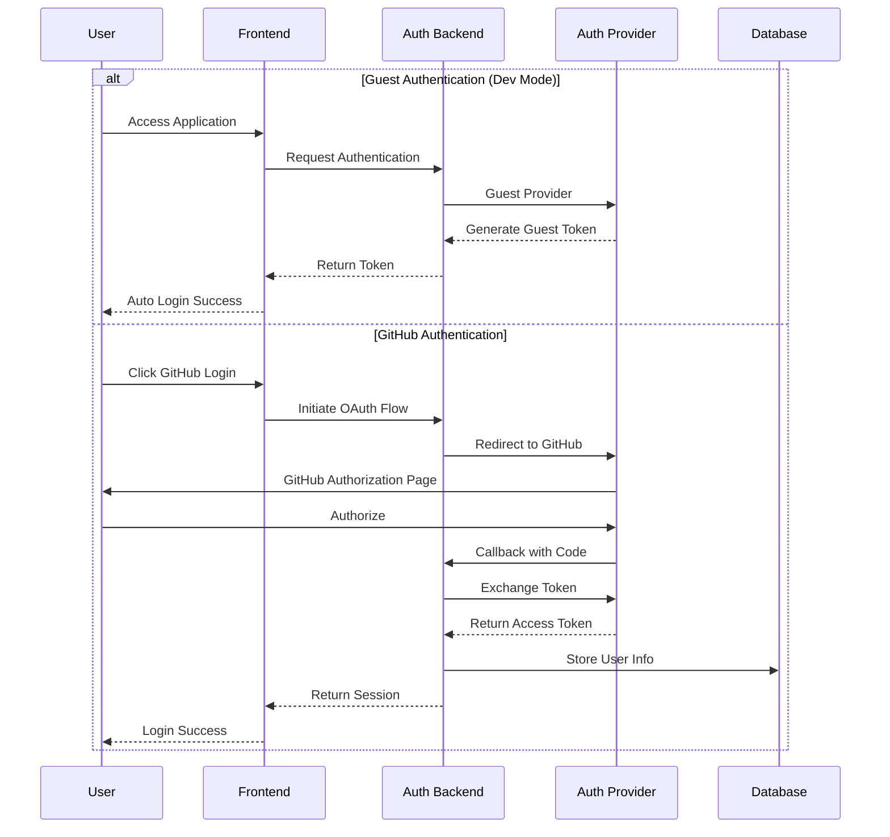

### 8.2 Permission System Architecture

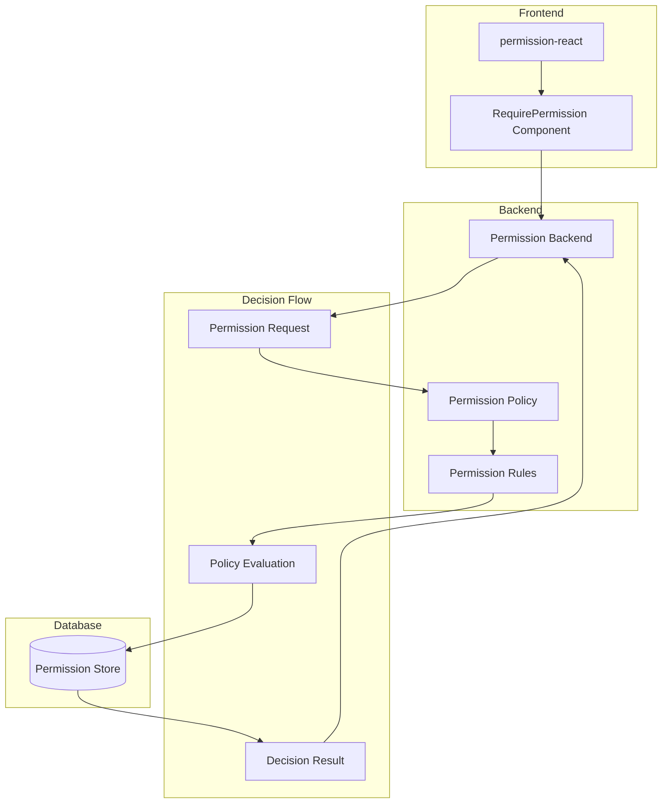

### 8.3 Current Permission Configuration

```yaml
# app-config.yaml
permission:
  enabled: true # Permission system is enabled
```

Current Policy: `AllowAllPolicy` (Allows all operations, suitable for development environment)

---

## 9. Deployment Architecture

### 9.1 Development Environment Deployment

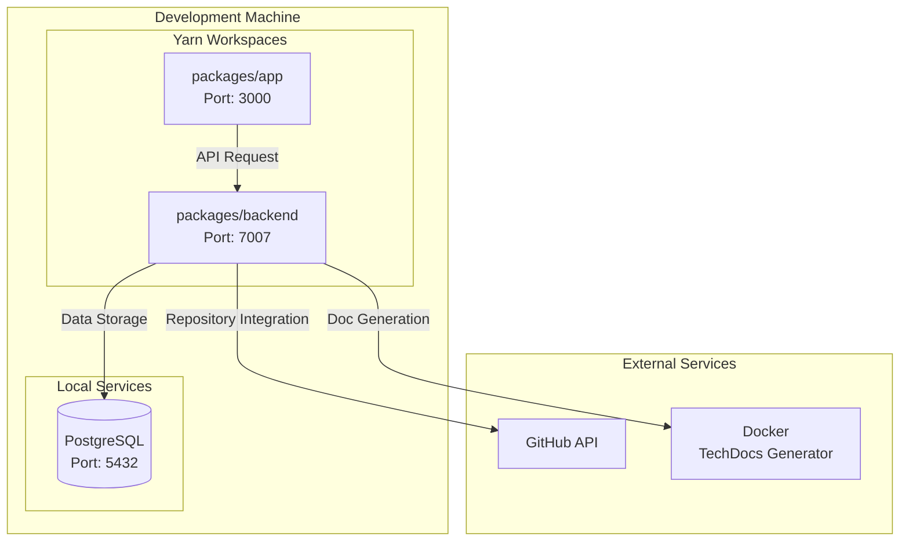

### 9.2 Production Environment Deployment

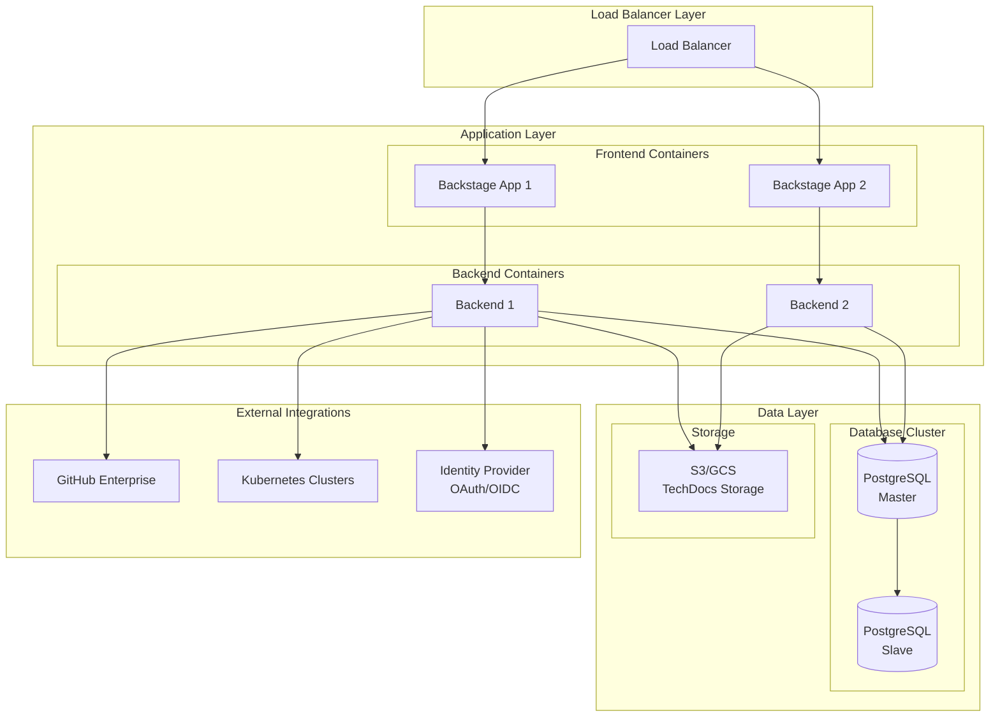

### 9.3 Docker Deployment

```dockerfile
# Simplified Dockerfile Structure
FROM node:22 AS builder
WORKDIR /app
COPY . .
RUN yarn install
RUN yarn build:backend

FROM node:22-slim
WORKDIR /app
COPY --from=builder /app/packages/backend/dist ./dist
COPY --from=builder /app/packages/backend/node_modules ./node_modules
EXPOSE 7007
CMD ["node", "dist/index.cjs.js"]
```

---

## 10. Technology Stack Details

### 10.1 Frontend Technology Stack

| Category    | Technology    | Version | Purpose            |
| ----------- | ------------- | ------- | ------------------ |
| Framework   | React         | ^18.0.2 | UI Framework       |
| Router      | React Router  | ^6.3.0  | Route Management   |
| UI Library  | Material-UI   | ^4.12.2 | Component Library  |
| Language    | TypeScript    | ~5.8.0  | Type Safety        |
| Build Tool  | Backstage CLI | ^0.35.2 | Bundling           |
| Testing     | Jest          | ^30.2.0 | Unit Testing       |
| E2E Testing | Playwright    | ^1.32.3 | End-to-End Testing |

### 10.2 Backend Technology Stack

| Category  | Technology     | Version                | Purpose            |
| --------- | -------------- | ---------------------- | ------------------ |
| Runtime   | Node.js        | 22/24                  | JavaScript Runtime |
| Framework | Express        | (via backend-defaults) | HTTP Service       |
| Language  | TypeScript     | ~5.8.0                 | Type Safety        |
| Database  | PostgreSQL     | -                      | Primary Database   |
| DB Client | pg             | ^8.11.3                | PostgreSQL Client  |
| SQLite    | better-sqlite3 | ^12.0.0                | Dev Database       |

### 10.3 Backstage Core Package Versions

| Package                     | Version | Role     |
| --------------------------- | ------- | -------- |
| @backstage/app-defaults     | ^1.7.4  | Frontend |
| @backstage/core-app-api     | ^1.19.3 | Frontend |
| @backstage/core-components  | ^0.18.5 | Frontend |
| @backstage/core-plugin-api  | ^1.12.1 | Frontend |
| @backstage/backend-defaults | ^0.15.0 | Backend  |
| @backstage/cli              | ^0.35.2 | Tooling  |
| @backstage/catalog-model    | ^1.7.6  | Shared   |

### 10.4 Project Directory Structure

```
backstage-demo/
├── app-config.yaml              # Development environment config
├── app-config.production.yaml   # Production environment config
├── backstage.json               # Backstage version info
├── catalog-info.yaml            # Project Catalog definition
├── package.json                 # Root package.json
├── tsconfig.json                # TypeScript config
├── playwright.config.ts         # E2E test config
│
├── packages/
│   ├── app/                     # Frontend application
│   │   ├── src/
│   │   │   ├── App.tsx          # App entry
│   │   │   ├── apis.ts          # API config
│   │   │   ├── index.tsx        # Render entry
│   │   │   └── components/      # UI components
│   │   │       ├── Root.tsx     # Root layout
│   │   │       ├── catalog/     # Catalog components
│   │   │       └── search/      # Search components
│   │   └── package.json
│   │
│   └── backend/                 # Backend service
│       ├── src/
│       │   └── index.ts         # Backend entry
│       ├── Dockerfile           # Docker build file
│       └── package.json
│
├── plugins/                     # Custom plugins directory
│
├── examples/                    # Sample data
    ├── entities.yaml            # Sample entities
    ├── org.yaml                 # Organization structure
    └── template/                # Software templates
        └── template.yaml

```

---

## Appendix

### A. Common Commands

| Command              | Description                 |
| -------------------- | --------------------------- |
| `yarn start`         | Start development server    |
| `yarn build:all`     | Build all packages          |
| `yarn build:backend` | Build backend only          |
| `yarn build-image`   | Build Docker image          |
| `yarn test`          | Run unit tests              |
| `yarn test:e2e`      | Run E2E tests               |
| `yarn lint`          | Code linting                |
| `yarn tsc`           | TypeScript type check       |
| `yarn new`           | Create new plugin/component |

### B. Port Configuration

| Service    | Port | Description         |
| ---------- | ---- | ------------------- |
| Frontend   | 3000 | React dev server    |
| Backend    | 7007 | Node.js API service |
| PostgreSQL | 5432 | Database service    |

### C. Environment Variables

| Variable         | Required   | Description              |
| ---------------- | ---------- | ------------------------ |
| `GITHUB_TOKEN`   | Yes        | GitHub integration token |
| `BACKEND_SECRET` | Production | Backend auth secret      |
