# Backstage 系统架构文档

> 本文档详细描述了 Backstage 开发者门户系统的架构设计

## 目录

1. [系统概览](#1-系统概览)
2. [整体架构图](#2-整体架构图)
3. [前端架构](#3-前端架构)
4. [后端架构](#4-后端架构)
5. [插件系统](#5-插件系统)
6. [数据流架构](#6-数据流架构)
7. [数据库设计](#7-数据库设计)
8. [认证与权限](#8-认证与权限)
9. [部署架构](#9-部署架构)
10. [技术栈详情](#10-技术栈详情)

---

## 1. 系统概览

### 1.1 项目信息

| 项目 | 值 |
|------|-----|
| 项目名称 | Backstage Demo |
| 版本 | 1.47.0 |
| 架构模式 | Monorepo (Yarn Workspaces) |
| 包管理器 | Yarn 4.4.1 |
| Node.js 版本 | 22 或 24 |

### 1.2 核心组件

```
┌─────────────────────────────────────────────────────────────────┐
│                    Backstage 开发者门户                          │
├─────────────────────────────────────────────────────────────────┤
│  ┌─────────────┐  ┌─────────────┐  ┌─────────────┐              │
│  │   前端 App  │  │  后端 API   │  │   数据库    │              │
│  │  (React)    │  │  (Node.js)  │  │ (PostgreSQL)│              │
│  └─────────────┘  └─────────────┘  └─────────────┘              │
│                                                                  │
│  ┌─────────────────────────────────────────────────────────┐    │
│  │                    插件系统                              │    │
│  │  Catalog | TechDocs | Scaffolder | Search | Kubernetes  │    │
│  └─────────────────────────────────────────────────────────┘    │
└─────────────────────────────────────────────────────────────────┘
```

---

## 2. 整体架构图

### 2.1 系统层次架构

```mermaid
graph TB
    subgraph "用户层"
        USER[用户/开发者]
        BROWSER[浏览器]
    end

    subgraph "前端层 - packages/app"
        REACT[React 应用]
        CORE_COMP[核心组件库<br/>@backstage/core-components]
        CORE_API[核心 API<br/>@backstage/core-app-api]
        PLUGIN_API[插件 API<br/>@backstage/core-plugin-api]
        MUI[Material-UI v4]
    end

    subgraph "插件层 - Frontend Plugins"
        CATALOG_FE[Catalog 插件]
        TECHDOCS_FE[TechDocs 插件]
        SCAFFOLDER_FE[Scaffolder 插件]
        SEARCH_FE[Search 插件]
        K8S_FE[Kubernetes 插件]
        NOTIF_FE[Notifications 插件]
        ORG_FE[Org 插件]
        API_DOCS_FE[API Docs 插件]
    end

    subgraph "后端层 - packages/backend"
        NODE[Node.js 服务]
        EXPRESS[HTTP 服务]
        WS[WebSocket/Signals]
    end

    subgraph "插件层 - Backend Plugins"
        CATALOG_BE[Catalog 后端]
        TECHDOCS_BE[TechDocs 后端]
        SCAFFOLDER_BE[Scaffolder 后端]
        SEARCH_BE[Search 后端]
        AUTH_BE[Auth 后端]
        PERM_BE[Permission 后端]
        K8S_BE[Kubernetes 后端]
        NOTIF_BE[Notifications 后端]
        PROXY_BE[Proxy 后端]
    end

    subgraph "数据层"
        PG[(PostgreSQL)]
        SQLITE[(SQLite<br/>开发模式)]
    end

    subgraph "外部集成"
        GITHUB[GitHub API]
        K8S_CLUSTER[Kubernetes 集群]
        DOCS_STORAGE[文档存储]
    end

    USER --> BROWSER
    BROWSER --> REACT
    REACT --> CORE_COMP
    REACT --> CORE_API
    REACT --> PLUGIN_API
    CORE_COMP --> MUI

    REACT --> CATALOG_FE
    REACT --> TECHDOCS_FE
    REACT --> SCAFFOLDER_FE
    REACT --> SEARCH_FE
    REACT --> K8S_FE
    REACT --> NOTIF_FE
    REACT --> ORG_FE
    REACT --> API_DOCS_FE

    CATALOG_FE --> EXPRESS
    TECHDOCS_FE --> EXPRESS
    SCAFFOLDER_FE --> EXPRESS
    SEARCH_FE --> EXPRESS
    K8S_FE --> EXPRESS
    NOTIF_FE --> WS

    EXPRESS --> CATALOG_BE
    EXPRESS --> TECHDOCS_BE
    EXPRESS --> SCAFFOLDER_BE
    EXPRESS --> SEARCH_BE
    EXPRESS --> AUTH_BE
    EXPRESS --> PERM_BE
    EXPRESS --> K8S_BE
    EXPRESS --> NOTIF_BE
    EXPRESS --> PROXY_BE

    CATALOG_BE --> PG
    CATALOG_BE --> SQLITE
    SEARCH_BE --> PG
    AUTH_BE --> PG
    PERM_BE --> PG
    NOTIF_BE --> PG

    CATALOG_BE --> GITHUB
    SCAFFOLDER_BE --> GITHUB
    K8S_BE --> K8S_CLUSTER
    TECHDOCS_BE --> DOCS_STORAGE
```

---

## 3. 前端架构

### 3.1 前端模块架构

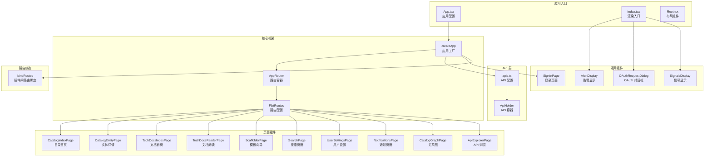

### 3.2 前端路由结构

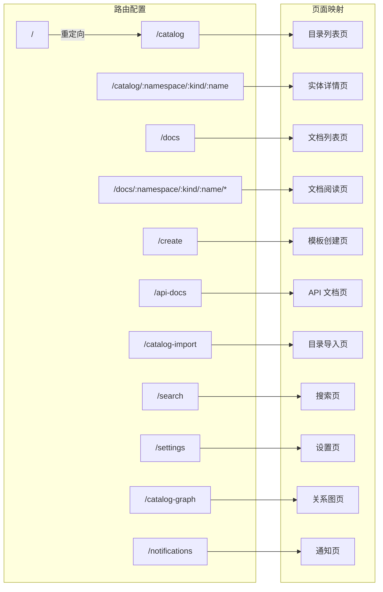

### 3.3 前端插件依赖关系

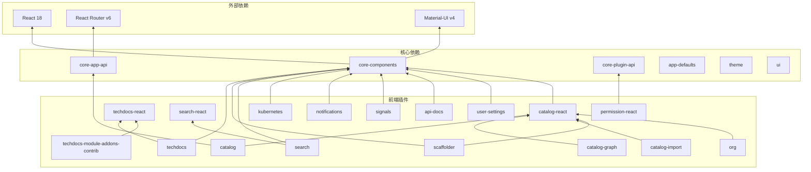

---

## 4. 后端架构

### 4.1 后端服务架构

```mermaid
graph TB
    subgraph "后端入口"
        INDEX_TS[index.ts]
        CREATE_BACKEND[createBackend]
        BACKEND[Backend 实例]
    end

    subgraph "核心插件"
        APP_BE[App Backend<br/>前端托管]
        PROXY_BE[Proxy Backend<br/>API 代理]
    end

    subgraph "认证模块"
        AUTH_BE[Auth Backend]
        GUEST_PROVIDER[Guest Provider<br/>访客认证]
        GITHUB_PROVIDER[GitHub Provider<br/>GitHub 认证]
    end

    subgraph "目录模块"
        CATALOG_BE[Catalog Backend]
        SCAFFOLDER_MODEL[Scaffolder Entity Model]
        CATALOG_LOGS[Catalog Logs Module]
    end

    subgraph "文档模块"
        TECHDOCS_BE[TechDocs Backend]
        DOCS_BUILDER[Local Builder]
        DOCS_GENERATOR[Docker Generator]
        DOCS_PUBLISHER[Local Publisher]
    end

    subgraph "模板模块"
        SCAFFOLDER_BE[Scaffolder Backend]
        GITHUB_MODULE[GitHub Module]
        NOTIF_MODULE[Notifications Module]
    end

    subgraph "搜索模块"
        SEARCH_BE[Search Backend]
        PG_ENGINE[PostgreSQL Engine]
        CATALOG_COLLATOR[Catalog Collator]
        TECHDOCS_COLLATOR[TechDocs Collator]
    end

    subgraph "权限模块"
        PERM_BE[Permission Backend]
        ALLOW_ALL[Allow All Policy]
    end

    subgraph "Kubernetes模块"
        K8S_BE[Kubernetes Backend]
    end

    subgraph "通知模块"
        NOTIF_BE[Notifications Backend]
        SIGNALS_BE[Signals Backend]
    end

    INDEX_TS --> CREATE_BACKEND
    CREATE_BACKEND --> BACKEND

    BACKEND --> APP_BE
    BACKEND --> PROXY_BE
    BACKEND --> AUTH_BE
    AUTH_BE --> GUEST_PROVIDER
    AUTH_BE --> GITHUB_PROVIDER

    BACKEND --> CATALOG_BE
    CATALOG_BE --> SCAFFOLDER_MODEL
    CATALOG_BE --> CATALOG_LOGS

    BACKEND --> TECHDOCS_BE
    TECHDOCS_BE --> DOCS_BUILDER
    DOCS_BUILDER --> DOCS_GENERATOR
    DOCS_BUILDER --> DOCS_PUBLISHER

    BACKEND --> SCAFFOLDER_BE
    SCAFFOLDER_BE --> GITHUB_MODULE
    SCAFFOLDER_BE --> NOTIF_MODULE

    BACKEND --> SEARCH_BE
    SEARCH_BE --> PG_ENGINE
    SEARCH_BE --> CATALOG_COLLATOR
    SEARCH_BE --> TECHDOCS_COLLATOR

    BACKEND --> PERM_BE
    PERM_BE --> ALLOW_ALL

    BACKEND --> K8S_BE

    BACKEND --> NOTIF_BE
    BACKEND --> SIGNALS_BE
```

### 4.2 后端插件加载顺序

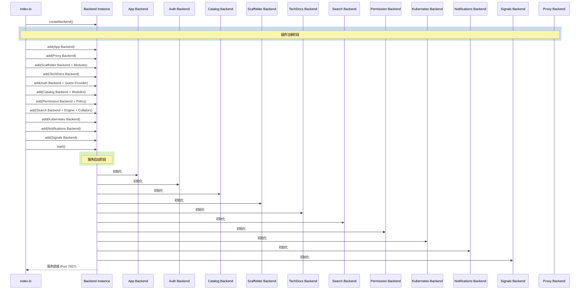

---

## 5. 插件系统

### 5.1 插件分类总览

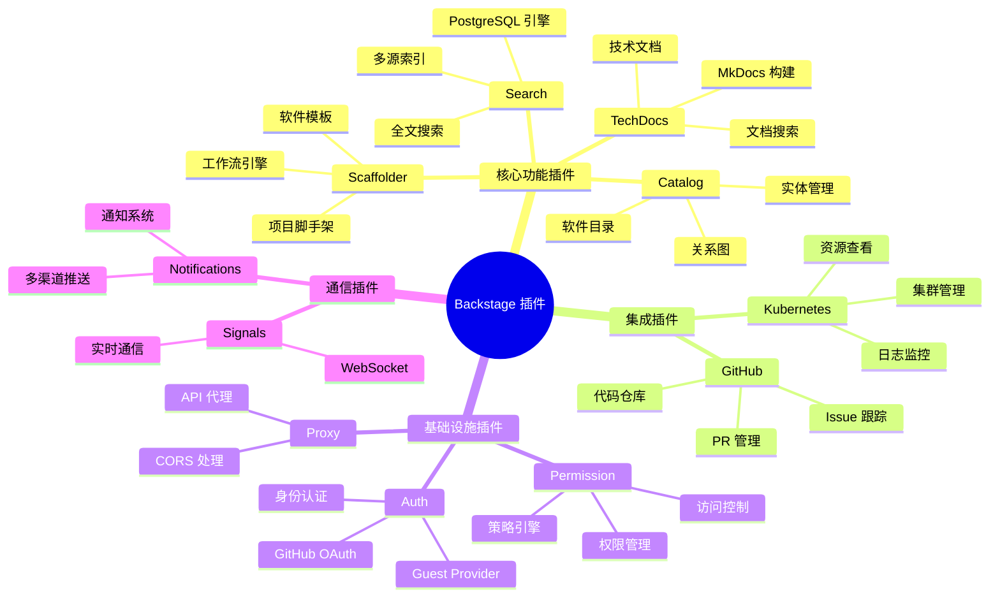

### 5.2 插件前后端对应关系

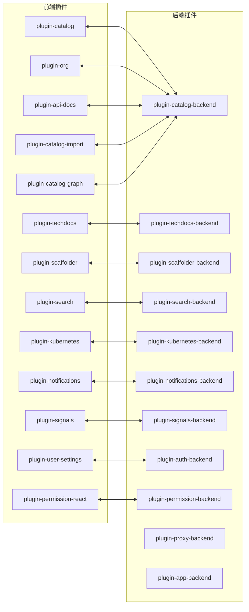

### 5.3 插件间路由绑定

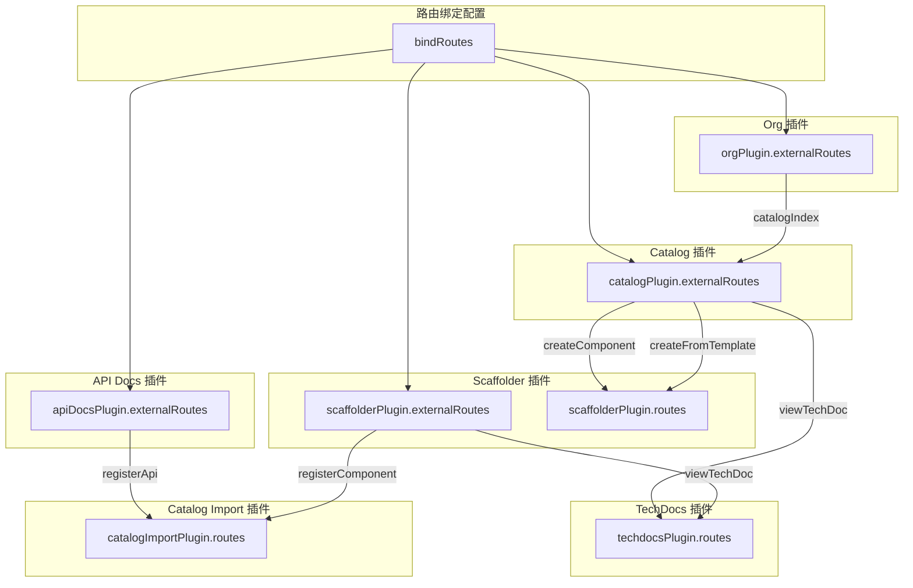

---

## 6. 数据流架构

### 6.1 请求处理流程

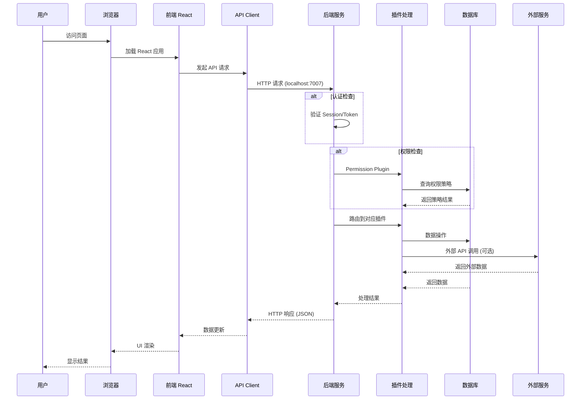

### 6.2 Catalog 数据流

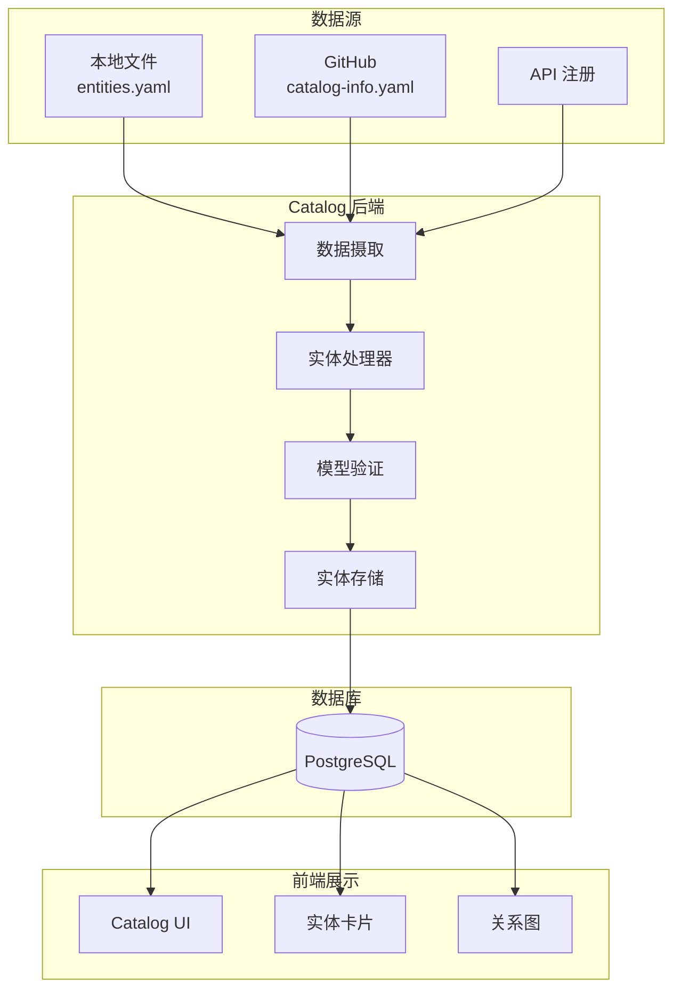

### 6.3 Scaffolder 工作流

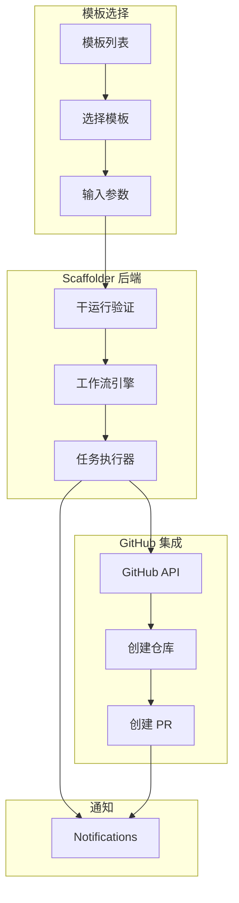

### 6.4 TechDocs 生成流程

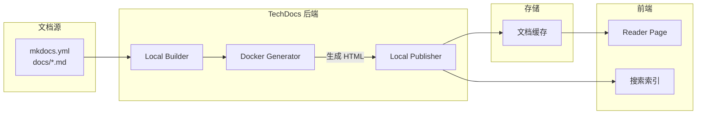

---

## 7. 数据库设计

### 7.1 数据库架构

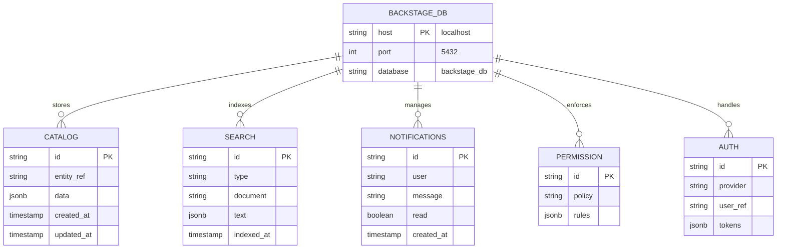

### 7.2 数据库配置

| 环境 | 客户端 | 连接方式 | Schema 模式 |
|------|--------|----------|-------------|
| 开发 | better-sqlite3 | :memory: | 单文件 |
| 生产 | pg (PostgreSQL) | localhost:5432 | pluginDivisionMode: schema |

```yaml
# 数据库配置 (app-config.yaml)
backend:
  database:
    client: pg
    pluginDivisionMode: schema  # 每个插件使用独立 schema
    connection:
      host: localhost
      port: 5432
      user: postgres
      password: '123456'
      database: backstage_db
```

---

## 8. 认证与权限

### 8.1 认证流程

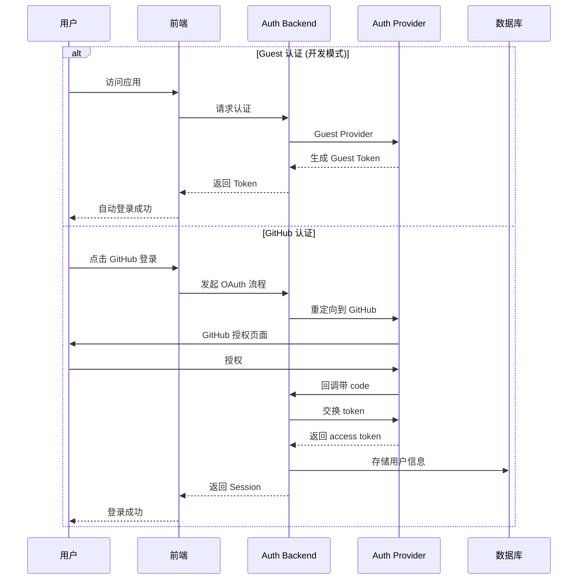

### 8.2 权限系统架构

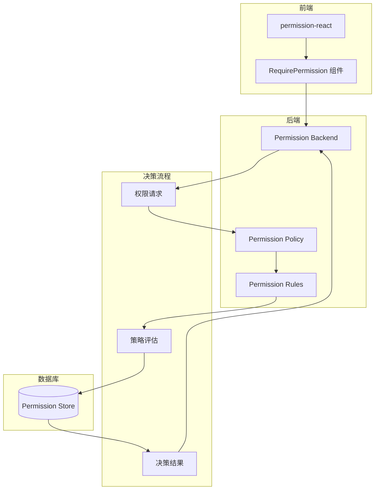

### 8.3 当前权限配置

```yaml
# app-config.yaml
permission:
  enabled: true  # 权限系统已启用
```

当前使用的策略: `AllowAllPolicy` (允许所有操作，适用于开发环境)

---

## 9. 部署架构

### 9.1 开发环境部署

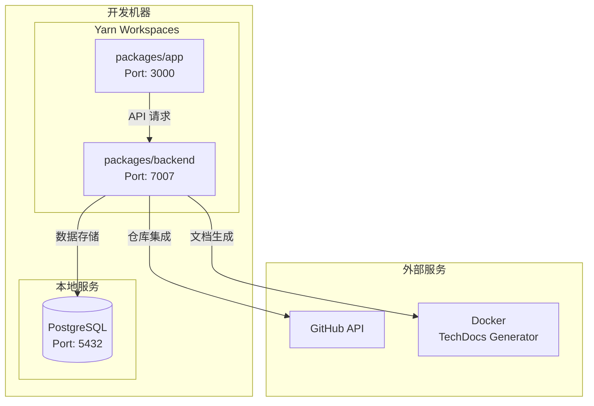

### 9.2 生产环境部署

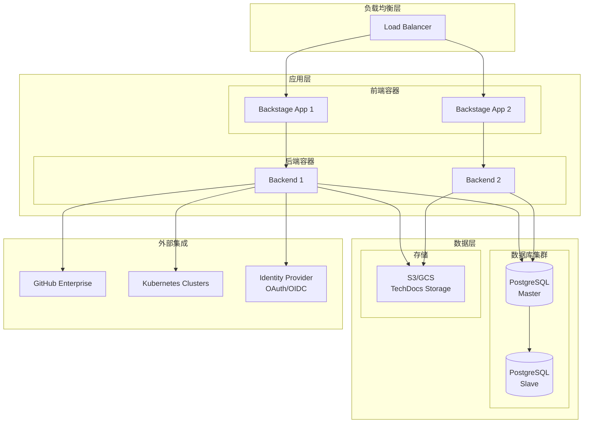

### 9.3 Docker 部署

```dockerfile
# 简化的 Dockerfile 结构
FROM node:22 AS builder
WORKDIR /app
COPY . .
RUN yarn install
RUN yarn build:backend

FROM node:22-slim
WORKDIR /app
COPY --from=builder /app/packages/backend/dist ./dist
COPY --from=builder /app/packages/backend/node_modules ./node_modules
EXPOSE 7007
CMD ["node", "dist/index.cjs.js"]
```

---

## 10. 技术栈详情

### 10.1 前端技术栈

| 类别 | 技术 | 版本 | 用途 |
|------|------|------|------|
| 框架 | React | ^18.0.2 | UI 框架 |
| 路由 | React Router | ^6.3.0 | 路由管理 |
| UI 库 | Material-UI | ^4.12.2 | 组件库 |
| 语言 | TypeScript | ~5.8.0 | 类型安全 |
| 构建工具 | Backstage CLI | ^0.35.2 | 打包构建 |
| 测试 | Jest | ^30.2.0 | 单元测试 |
| E2E 测试 | Playwright | ^1.32.3 | 端到端测试 |

### 10.2 后端技术栈

| 类别 | 技术 | 版本 | 用途 |
|------|------|------|------|
| 运行时 | Node.js | 22/24 | JavaScript 运行环境 |
| 框架 | Express | (via backend-defaults) | HTTP 服务 |
| 语言 | TypeScript | ~5.8.0 | 类型安全 |
| 数据库 | PostgreSQL | - | 主数据库 |
| 数据库客户端 | pg | ^8.11.3 | PostgreSQL 客户端 |
| SQLite | better-sqlite3 | ^12.0.0 | 开发数据库 |

### 10.3 Backstage 核心包版本

| 包名 | 版本 | 角色 |
|------|------|------|
| @backstage/app-defaults | ^1.7.4 | 前端 |
| @backstage/core-app-api | ^1.19.3 | 前端 |
| @backstage/core-components | ^0.18.5 | 前端 |
| @backstage/core-plugin-api | ^1.12.1 | 前端 |
| @backstage/backend-defaults | ^0.15.0 | 后端 |
| @backstage/cli | ^0.35.2 | 工具 |
| @backstage/catalog-model | ^1.7.6 | 共享 |

### 10.4 项目目录结构

```
backstage-demo/
├── app-config.yaml              # 开发环境配置
├── app-config.production.yaml   # 生产环境配置
├── backstage.json               # Backstage 版本信息
├── catalog-info.yaml            # 项目 Catalog 定义
├── package.json                 # 根 package.json
├── tsconfig.json                # TypeScript 配置
├── playwright.config.ts         # E2E 测试配置
│
├── packages/
│   ├── app/                     # 前端应用
│   │   ├── src/
│   │   │   ├── App.tsx          # 应用入口
│   │   │   ├── apis.ts          # API 配置
│   │   │   ├── index.tsx        # 渲染入口
│   │   │   └── components/      # UI 组件
│   │   │       ├── Root.tsx     # 根布局
│   │   │       ├── catalog/     # Catalog 组件
│   │   │       └── search/      # Search 组件
│   │   └── package.json
│   │
│   └── backend/                 # 后端服务
│       ├── src/
│       │   └── index.ts         # 后端入口
│       ├── Dockerfile           # Docker 构建文件
│       └── package.json
│
├── plugins/                     # 自定义插件目录
│
├── examples/                    # 示例数据
│   ├── entities.yaml            # 示例实体
│   ├── org.yaml                 # 组织结构
│   └── template/                # 软件模板
│       └── template.yaml
│
└── docs/                        # 文档目录
    └── architecture.md          # 本文档
```

---

## 附录

### A. 常用命令

| 命令 | 描述 |
|------|------|
| `yarn start` | 启动开发服务器 |
| `yarn build:all` | 构建所有包 |
| `yarn build:backend` | 仅构建后端 |
| `yarn build-image` | 构建 Docker 镜像 |
| `yarn test` | 运行单元测试 |
| `yarn test:e2e` | 运行 E2E 测试 |
| `yarn lint` | 代码检查 |
| `yarn tsc` | TypeScript 类型检查 |
| `yarn new` | 创建新插件/组件 |

### B. 端口配置

| 服务 | 端口 | 说明 |
|------|------|------|
| 前端 | 3000 | React 开发服务器 |
| 后端 | 7007 | Node.js API 服务 |
| PostgreSQL | 5432 | 数据库服务 |

### C. 环境变量

| 变量 | 必需 | 说明 |
|------|------|------|
| `GITHUB_TOKEN` | 是 | GitHub 集成令牌 |
| `BACKEND_SECRET` | 生产 | 后端认证密钥 |

---

*文档生成时间: 2026-03-02*
*Backstage 版本: 1.47.0*
